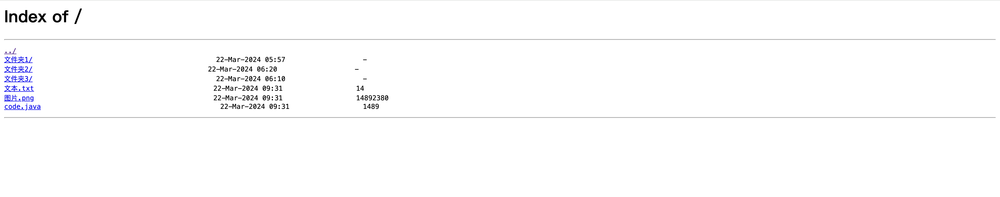
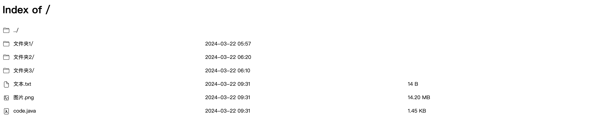

# Nginx Autoindex

最近想搭建一台文件服务器，用于存放一些文件。但又要确保放上去的 html 文件可以直接在浏览器上访问，比如：产品需要将 axure 生成的 html 文件放上去后，进入相应的目录可以直接访问。因此选择了 nginx，但原生界面属实太丑了，网上找了一些方案有的需要安装插件，有的会影响对 html 文件的预览。所以自己花了一点点时间写了个简单的美化界面。

## 思路

其实就是利用 nginx 的 [autoindex](http://nginx.org/en/docs/http/ngx_http_autoindex_module.html) 模块，通过修改 nginx.conf 配置文件中的 add_after_body 配置项来实现美化的。主要通过 js 将原生界面的 dom 元素提取出来，然后重新布局添加样式，最后添加到页面中并移出原来的 dom 元素。
如果你不喜欢我的美化样式，也可以自行修改 .autoindex.html 中的相关样式。

## 介绍

美化之前是这样的：


美化之后是这样的：


## 如何使用

首先查看你的 nginx 配置，找到你配置的 autoindex 的 root 目录。然后将本项目中的 .autoindex.html 文件复制你配置到 root 的目录下，然后在 nginx 配置文件中添加 `add_after_body /.autoindex.html;`，最后重启 nginx 即可。

最终的 nginx 配置可能如下：

```
server {
    listen       80;
    listen  [::]:80;
    server_name  localhost;
    charset utf-8;

    location / {
        root   /usr/share/nginx/html;
        sendfile    on;
        autoindex   on;
        autoindex_exact_size  on;
        autoindex_localtime   off;
        add_after_body /.autoindex.html;
    }
}
```

## 最后

如果你喜欢这个项目，请给个 star 吧。（●’◡’●）
